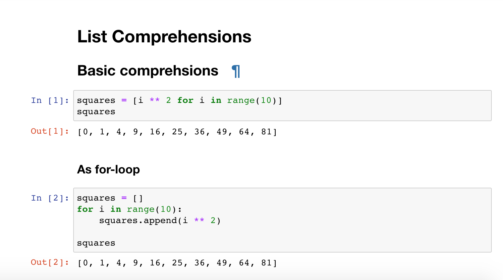
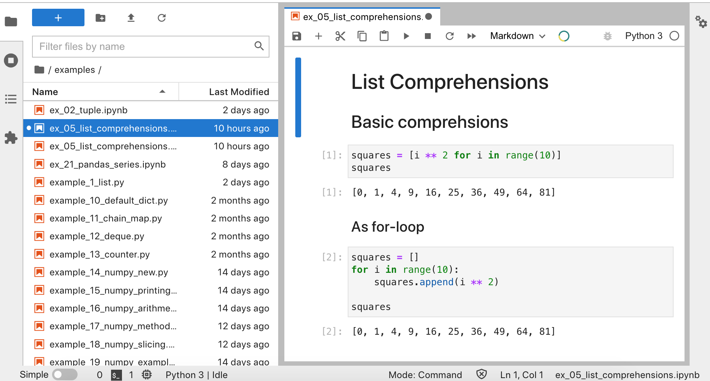
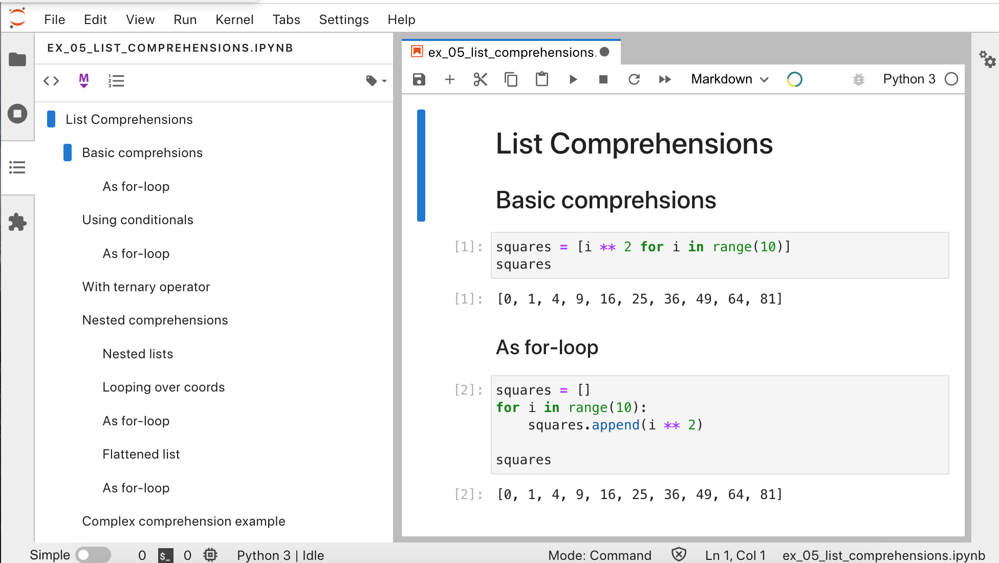

# Jupyter notebooks

## About notebooks
**Jupyter notebooks** are **.ipynb** files, where Python code is broken up into **cells**.
Cells can be run, edited and rerun, in whatever order you like.
You can see the result of a cell immediately below it.

In addition, you can include **Markdown** formatted text
throughout the document, to provide headings, descriptions, notes and links.

## Why use them?

They are a convenient way to write Python code that:

- has a linear flow
- has multiple sections/steps
- requires text explanation
- returns images or plots
- you want to share with others and allow them to reproduce your work

They are often used in data science, since you often follow these steps:

- load some data
- clean it
- find information about it
- plot some results
- export it

They are a useful teaching tool because it allows you to:

- break code down into small chunks (in cells)
- cells can be edited, and rerun by the learner
- formatted text can provide a lot more information and is more readable than comments

## Jupyter Lab vs Jupyter Notebook

**Jupyter Notebook** is the original way of working with notebooks.

When you choose to launch a notebook, it opens up in a new browser tab.

It has more limited capabilities.

**Jupyter Lab** is more like an IDE in the browser.

It provides a directory structure on the left, like PyCharm.
And when you open a file, it opens in tabs on the right.

One great feature is the **Table of contents** view
that gives you an overview of the headings in the document
and allows you to navigate to different sections quickly.

