# Using PyCharm to manage your course environment

- [Set your Python interpreter for your project](#set-your-python-interpreter-for-your-project)
- [Install required external packages](#install-required-external-packages)
- [Run **Jupyter Lab**](#run-jupyter-lab)
- [Run the .ipynb files](#run-the-ipynb-files)

## Set your Python interpreter for your project

This course requires Python 3.7 or higher.

If your project is using the wrong version of Python, 
or if you want to create a virtual environment for the project,
follow [these instructions](PYCHARM_INTERPRETER.md).

   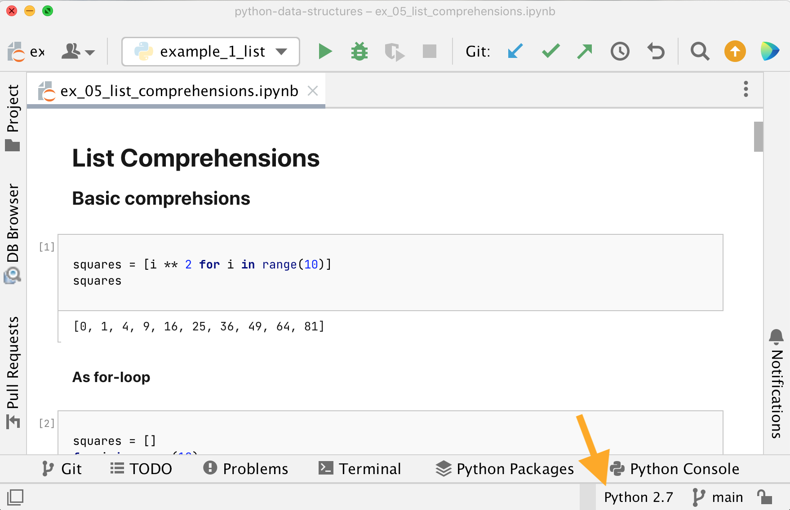

## Install required external packages

1. Open the **Python Packages** view from the bottom toolbar

   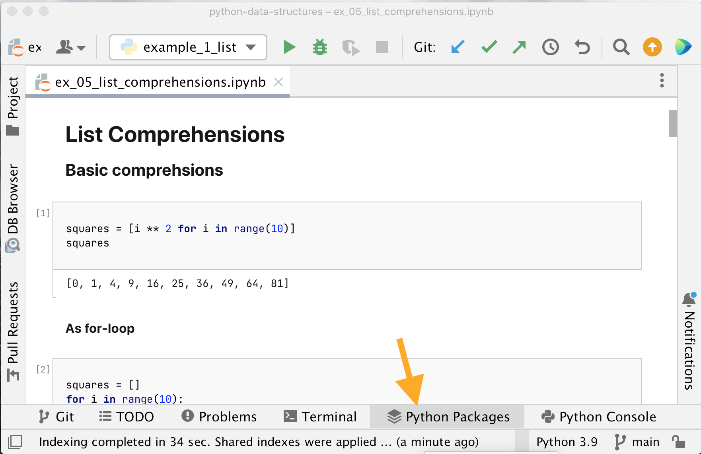

2. Install the desired package

   - `numpy` and `pandas` to run the example code (.ipynb and .py files)
     
   - `jupyter` to run the .ipynb notebook files (_recommended_)

   1. Search for the package name
   2. Select the matching one
   3. Click **Install package**

   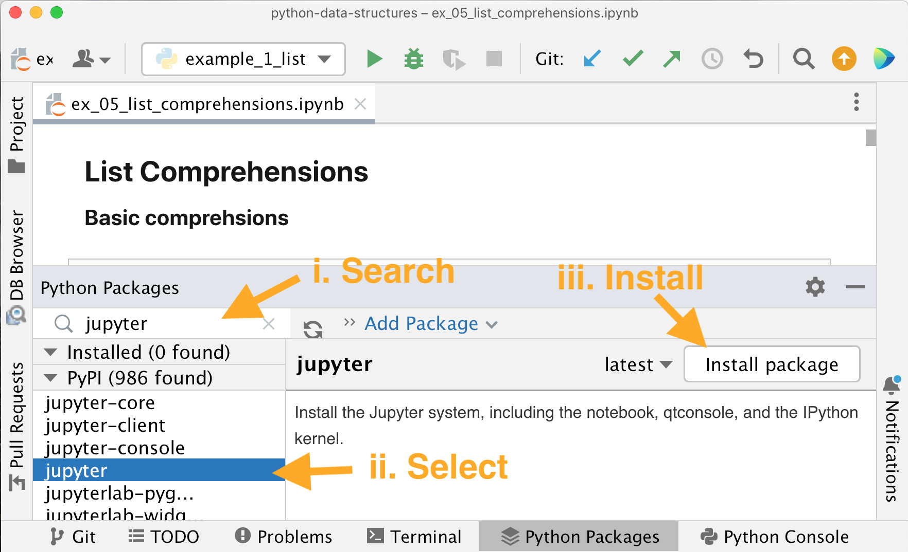

3. You should then see the installed packages in the list on the left.

   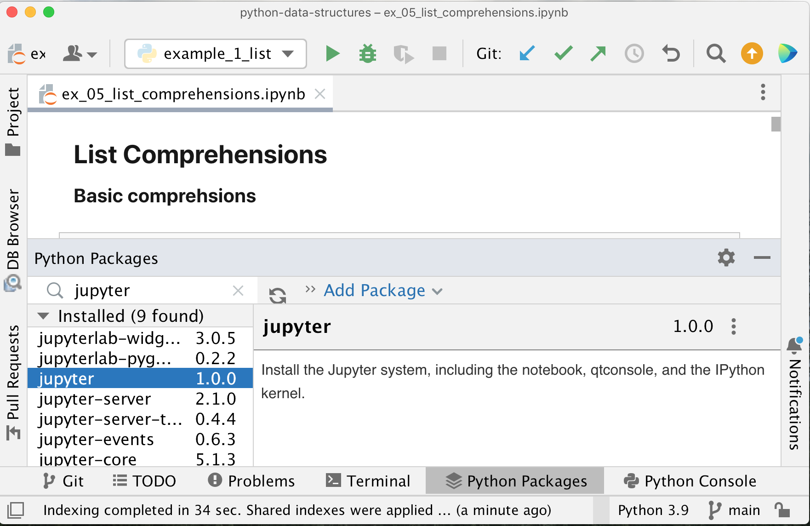

## Run **Jupyter Lab**

Once you've installed Jupyter in your Python interpreter, 
you can launch [Jupyter Lab and Jupyter Notebook](NOTEBOOKS.md) from the terminal.

1. Open a terminal and input the command `jupyter lab` or `jupyter notebook`

   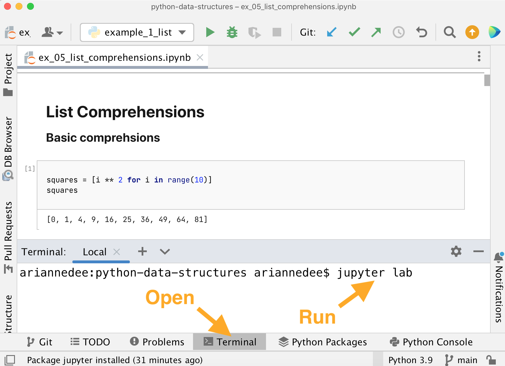

2. You will see some links printed to the console and a browser tab should open

   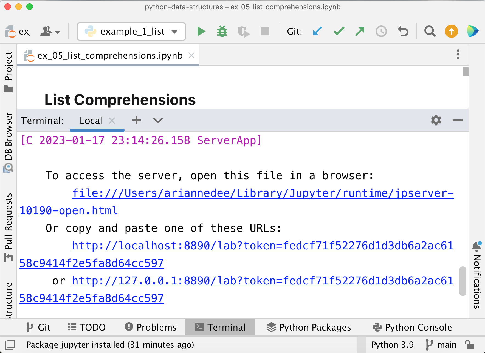
   
3. You are now running Jupyter Lab or Jupyter Notebook in the browser

   **Jupyter Lab**

   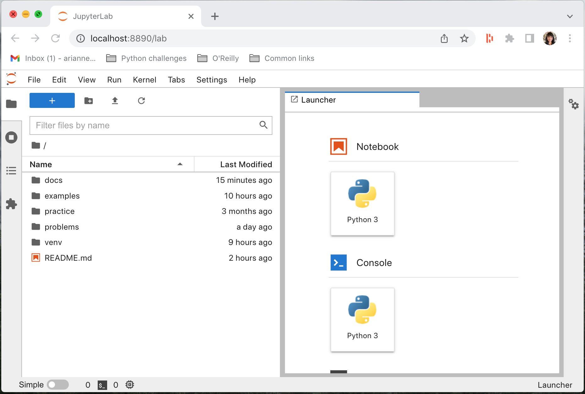

   **Jupyter Notebook**

   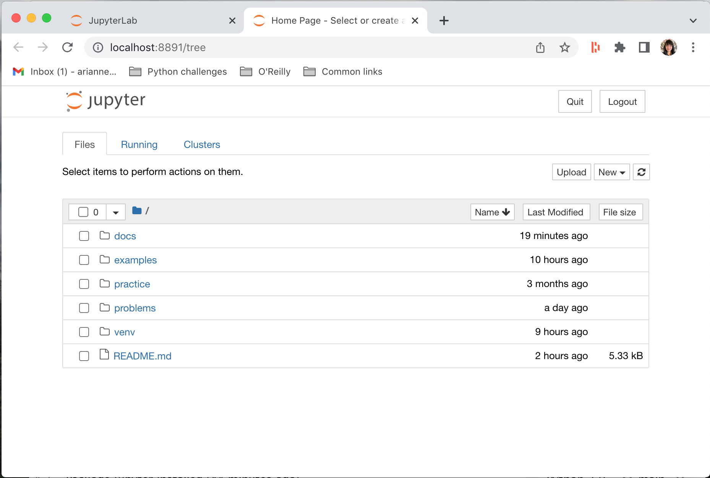

### PyCharm Professional option

You can open a specific notebook in Jupyter Notebook

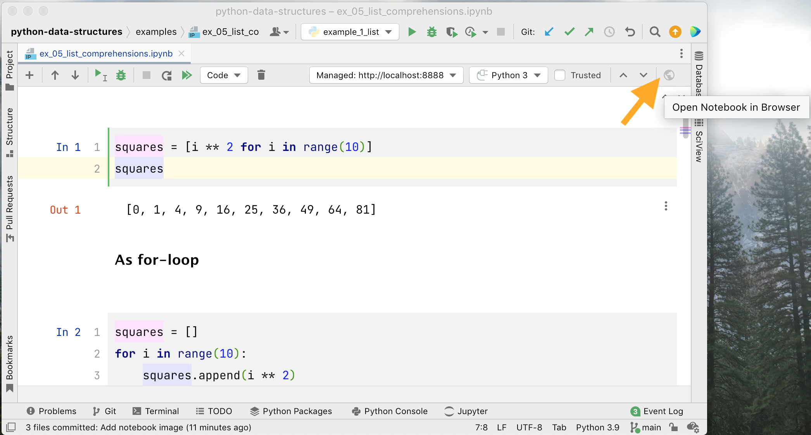

## Run the .ipynb files

[About notebooks](NOTEBOOKS.md)

### In PyCharm Community

Notebooks are view-only in PyCharm community.

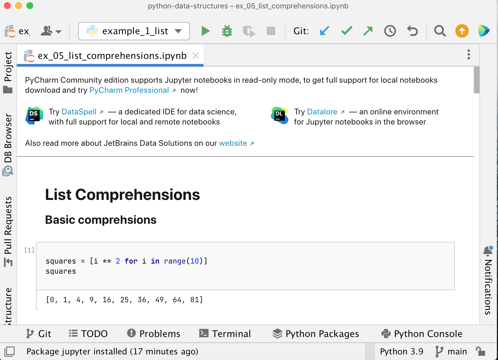

You can run the corresponding _.py_ files and the results will print to the **Run** console.
Alternatively, you can open the Python Console and copy and paste the contents of a code cell to run it.

### Run a single cell

Select a code cell and click the run button to run it (or press SHIFT + ENTER).

**PyCharm Professional**

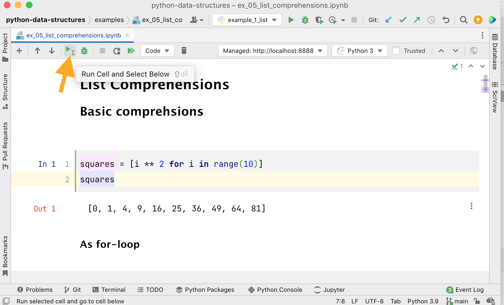

**Jupyter Lab**

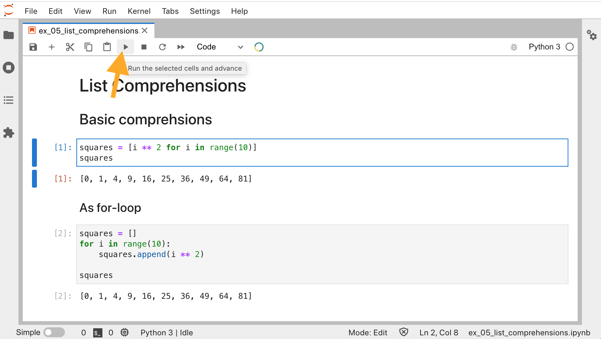

**Jupyter Notebook**

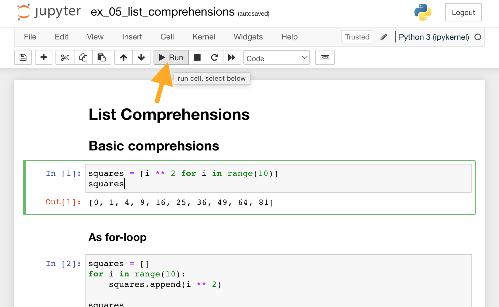

### Run all

This restarts the Python session, clearing any variables,
and runs the whole notebook from top to bottom

**PyCharm Professional**

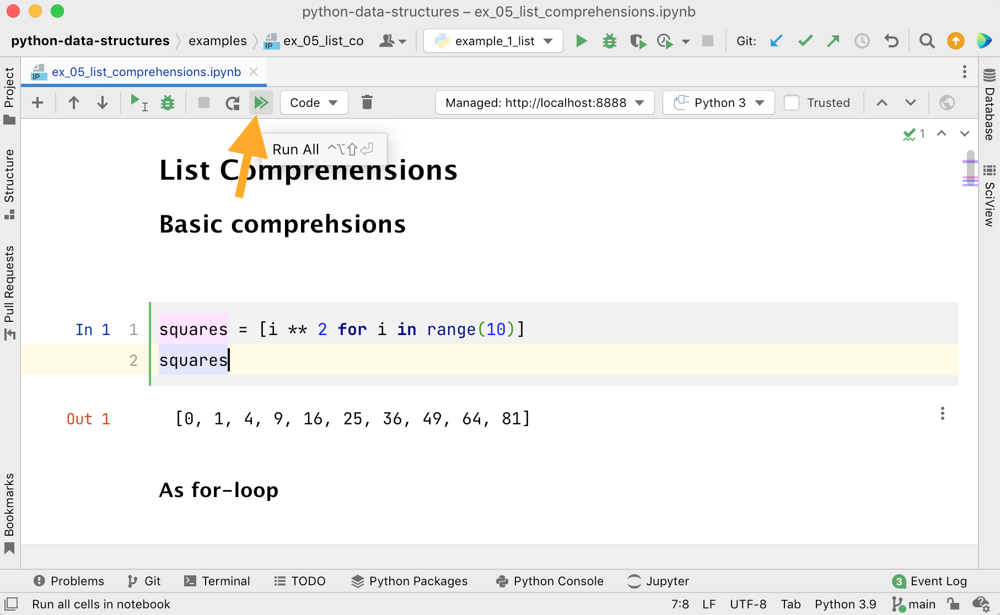

**Jupyter Lab**

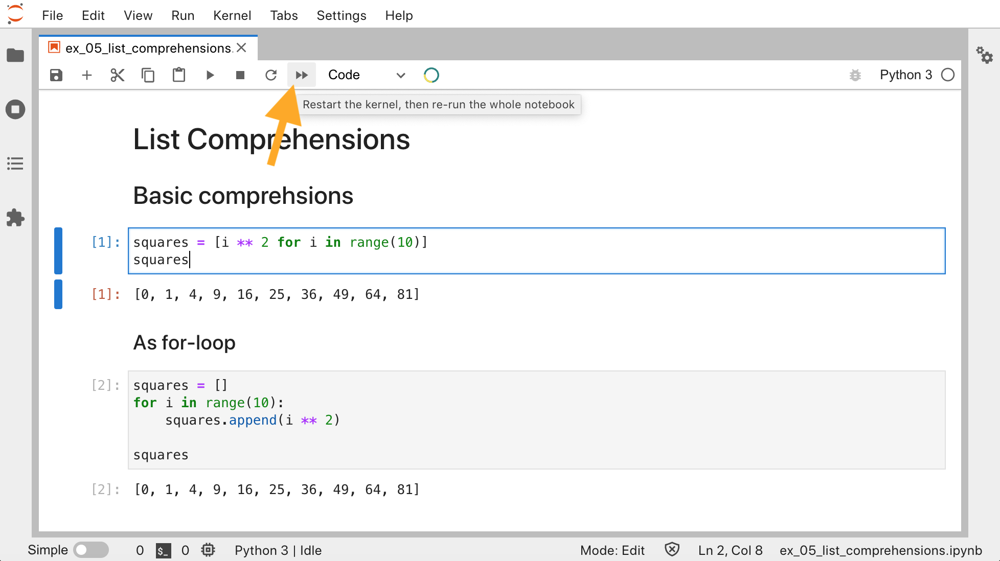

**Jupyter Notebook**

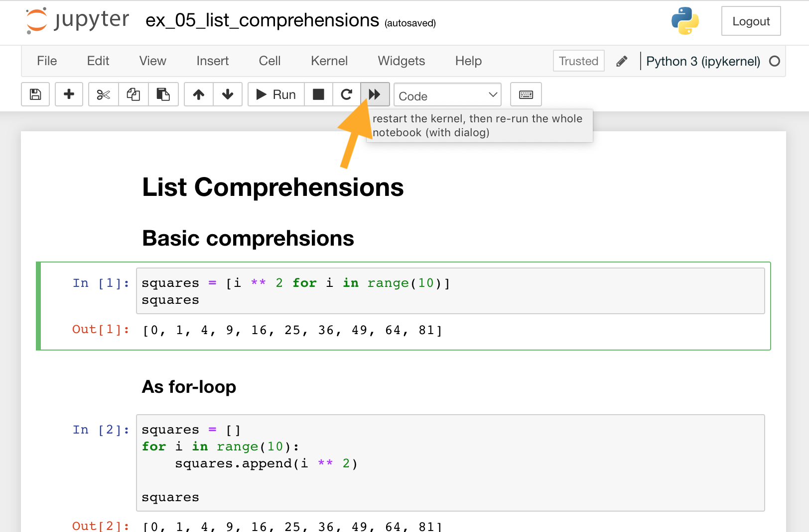
